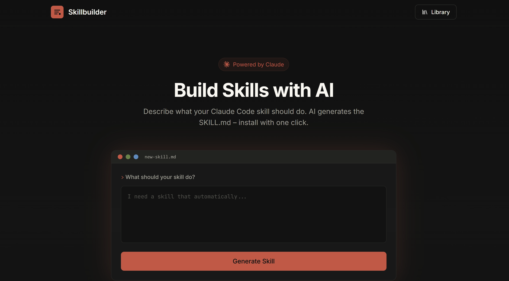

<p align="center">
  
</p>

<h1 align="center">Skillbuilder</h1>

<p align="center">
  <strong>Create Claude Code Skills with AI – describe what you need, get a ready-to-use skill</strong>
</p>

<p align="center">
  <a href="https://skills-claude.com">
    
  </a>
  <a href="https://x.com/lenny_enderle">
    
  </a>
  <a href="LICENSE">
    
  </a>
</p>

<p align="center">
  
  
  
  
</p>

---

## What is this?

**Skillbuilder** lets you create [Claude Code Skills](https://docs.anthropic.com/en/docs/claude-code) using natural language. No coding required.

1. **Describe** what your skill should do
2. **AI generates** a complete `SKILL.md` file
3. **Install** with one command in Claude Code

Skills teach Claude how to perform specific tasks – from writing commit messages to generating documentation.

---

## ✨ Features

| Feature | Description |
|---------|-------------|
| 🤖 **AI-Powered** | Describe your skill in plain English, Claude creates it |
| 🔑 **Bring Your Own Key** | Use your own Anthropic API key (stored locally, never sent to server) |
| 📋 **One-Click Install** | Copy command → paste in Claude Code → done |
| 📚 **Skill Library** | Browse and share community-created skills |
| 🎨 **Beautiful UI** | Dark theme with Claude brand aesthetics |
| 🔒 **Secure** | Rate limiting, input sanitization, error handling |

---

## 🚀 Live Demo

**[skills-claude.com](https://skills-claude.com)**

---

## 🛠️ Self-Hosting

### Prerequisites

- Node.js 18+
- Anthropic API Key ([Get one here](https://console.anthropic.com/settings/keys))

### Quick Start

```bash
# Clone
git clone https://github.com/lennystepn-hue/skillbuilder.git
cd skillbuilder

# Install
npm install && cd client && npm install && cd ..

# Configure
cp .env.example .env
# Add your ANTHROPIC_API_KEY to .env

# Run
npm run dev        # Development
npm run build      # Build for production
npm start          # Production
```

### Environment Variables

```env
ANTHROPIC_API_KEY=sk-ant-api03-...   # Required
PORT=3001                             # Optional (default: 3001)
NODE_ENV=production                   # Optional
```

### Docker

```bash
docker build -t skillbuilder .
docker run -p 3001:3001 -e ANTHROPIC_API_KEY=sk-ant-... skillbuilder
```

---

## 📁 Project Structure

```
skillbuilder/
├── client/                # React frontend
│   ├── src/
│   │   ├── App.jsx        # Main app with BYOK settings
│   │   ├── pages/
│   │   │   ├── Editor.jsx # Skill viewer + install
│   │   │   └── Library.jsx# Browse skills
│   │   └── index.css      # Tailwind + custom styles
│   └── package.json
├── server/                # Express backend
│   ├── index.js           # Server with rate limiting
│   ├── routes/
│   │   ├── generate.js    # AI generation endpoint
│   │   └── skills.js      # CRUD endpoints
│   └── services/
│       └── claude.js      # Claude API integration
└── package.json
```

---

## 🔌 API Endpoints

| Method | Endpoint | Description |
|--------|----------|-------------|
| `GET` | `/api/health` | Health check + uptime |
| `POST` | `/api/generate` | Generate skill from prompt |
| `GET` | `/api/skills` | List published skills |
| `GET` | `/api/skills/:id` | Get skill by ID |
| `GET` | `/api/skills/:id/raw` | Get raw SKILL.md content |

---

## 📖 How Claude Code Skills Work

Skills are markdown files that teach Claude specific workflows. They live in:

```
~/.claude/skills/
└── my-skill/
    └── SKILL.md
```

Example skill structure:
```yaml
---
name: my-skill
description: When to activate this skill
---

# My Skill

## Overview
What this skill does

## Instructions
Step-by-step guide for Claude

## Examples
Input/output examples
```

📚 [Claude Code Skills Documentation](https://docs.anthropic.com/en/docs/claude-code)

---

## 🤝 Contributing

Contributions welcome!

- 🐛 **Found a bug?** Open an issue
- 💡 **Have an idea?** Start a discussion
- 🔧 **Want to contribute?** Fork & PR

---

## 📄 License

MIT License – do whatever you want with it.

---

<p align="center">
  <sub>Built with ☕ by <a href="https://x.com/lenny_enderle">@lenny_enderle</a></sub>
</p>

<p align="center">
  
</p>
